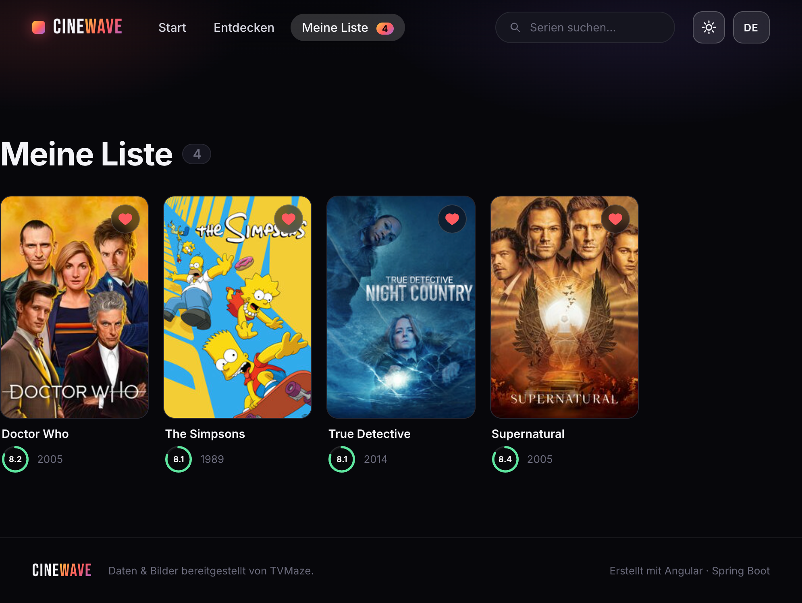

# 🎬 CineWave

A cinematic TV-show discovery app — trending carousels, full-bleed hero art, cast,
season stats and a personal watchlist. **Angular 19** front end, **Spring Boot 3** back
end, powered by the free **[TVMaze API](https://www.tvmaze.com/api)** — **no API key,
no signup, nothing to configure.**

The backend is a small **Backend-for-Frontend (BFF)**: TVMaze has no curated
"trending / popular" endpoints, so CineWave fetches a catalog of shows once, caches it,
then sorts and filters it different ways to power the home rows, browse and
"more like this". It also normalises TVMaze's payloads (stripping HTML, flattening
images) into a compact shape the Angular client consumes.

---

## 📸 Screenshots

Home — cinematic hero & carousels, in both themes:

| Dark | Light |
|------|-------|
|  |  |

| Browse | My List |
|--------|---------|
|  |  |

---

## ✨ Features

- **Home** — auto-rotating hero with Ken-Burns art + carousels (Trending, Top Rated, Airing Now, Newly Premiered, Modern Classics)
- **Show details** — backdrop hero, poster, genres, **network / season / episode stats**, cast strip, and a genre-based "More Like This"
- **Browse** — filter by genre, sort by Popular / Top Rated / Newest, infinite "Load more"
- **Search** — instant results wired to the navbar search box
- **My List** — a watchlist persisted in `localStorage` (reactive via Angular signals)
- Cinematic dark UI: glassmorphism navbar, rating rings, hover reveals, skeleton loaders

---

## 🗂 Project structure

```
cinewave/
├── backend/   Spring Boot 3.3 · Java 17 · RestClient + Caffeine cache
└── frontend/  Angular 19 · standalone components · signals
```

### API (backend → `/api`)

| Endpoint                      | Purpose                                   |
|-------------------------------|-------------------------------------------|
| `GET /api/movies/trending`    | Most popular shows (hero + row)           |
| `GET /api/movies/popular`     | "Modern Classics" — finished, top-rated   |
| `GET /api/movies/top-rated`   | Highest rated (`?page=`)                  |
| `GET /api/movies/upcoming`    | Newly premiered                           |
| `GET /api/movies/now-playing` | Currently airing                          |
| `GET /api/movies/{id}`        | Details + cast + season stats + similar   |
| `GET /api/search?q=`          | Search shows                              |
| `GET /api/discover`           | `?genre=&sort=popularity\|rating\|newest&page=` |
| `GET /api/genres`             | Genre list (derived from the catalog)     |

---

## ▶️ 1. Run the backend

No key, no setup — just start it (you already have Java 17 + Maven):

```bash
cd backend
mvn spring-boot:run
```

Backend starts on **http://localhost:8080**. Quick check:

```bash
curl "http://localhost:8080/api/movies/trending"
```

Run the unit tests:

```bash
mvn test
```

Optional env vars: `TVMAZE_CATALOG_PAGES` (default `3` — i.e. ~750 shows in the
catalog), `CORS_ORIGINS` (default `http://localhost:4200`).

---

## ▶️ 2. Run the frontend

```bash
cd frontend
npm install
npm start
```

Open **http://localhost:4200**. The dev server proxies `/api` → `localhost:8080`
(see `proxy.conf.json`), so just keep the backend running alongside it.

Production build:

```bash
npm run build      # outputs dist/cinewave
```

---

## 🛠 Tech & design notes

- **Free, keyless data** — every call goes through the Spring backend to TVMaze.
- **Self-built feeds** — an in-memory catalog (a few cached index pages) is sorted by
  `weight` (popularity), `rating` and air dates to synthesise the home rows.
- **Caching** — Caffeine, so the catalog is fetched at most once per TTL.
- **Clean layering** — `TvMazeClient` (HTTP) → `ShowMapper` (JSON→records) → `CatalogService` / `ShowService` (cache + orchestration) → thin controllers.
- **Angular** — standalone components, signals for state, the new `@if`/`@for` control flow, lazy-loaded routes.
- **Watchlist** — `localStorage`-backed, exposed as signals so the UI updates instantly.

---

*This product uses the TVMaze API but is not endorsed or certified by TVMaze.*
